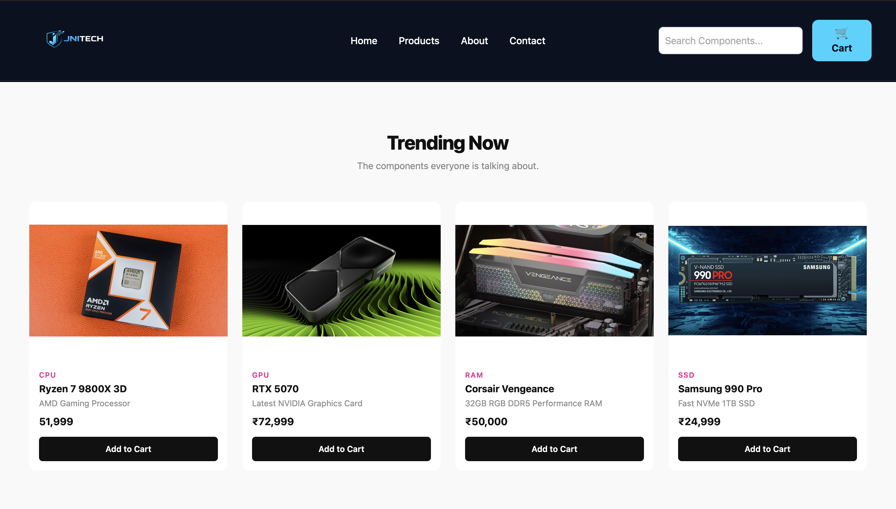
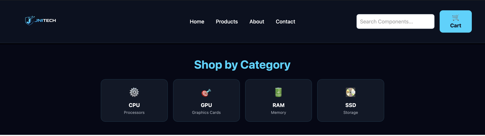
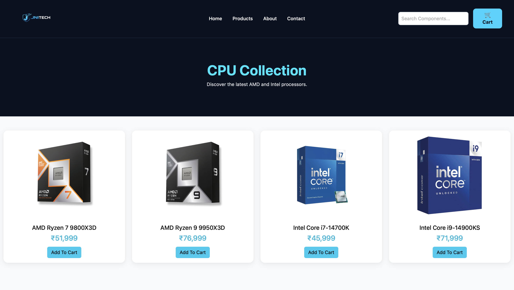
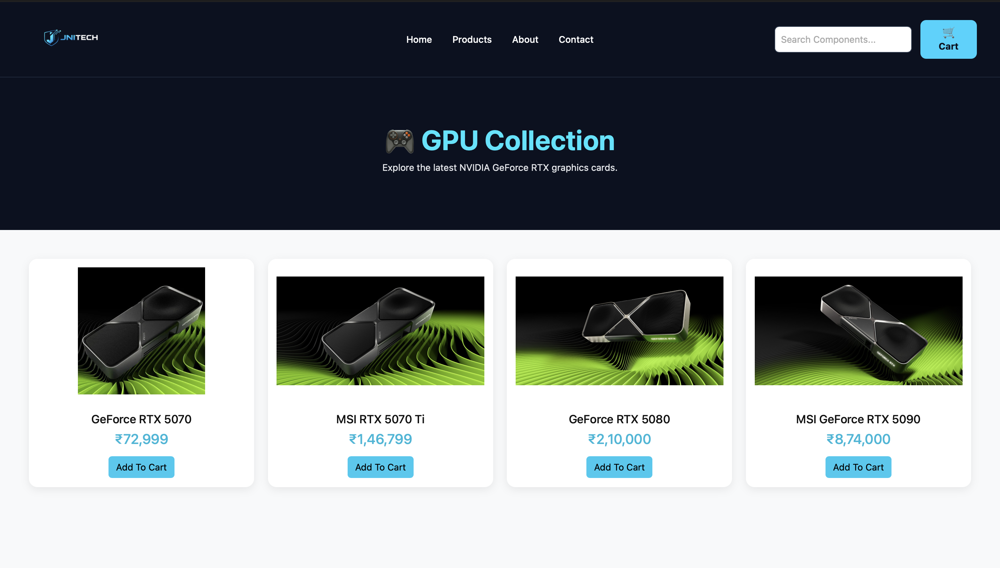
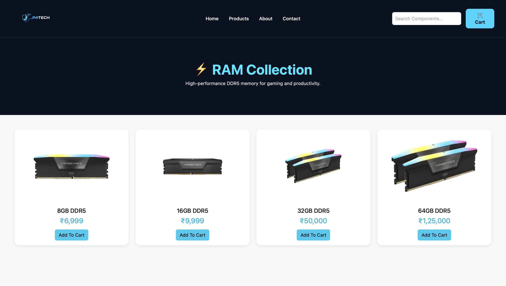
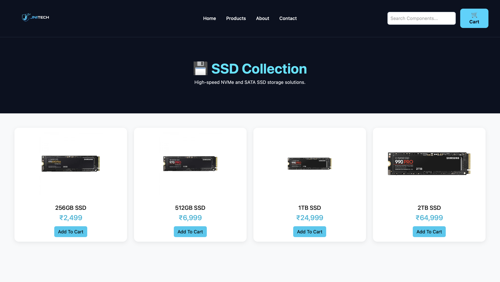
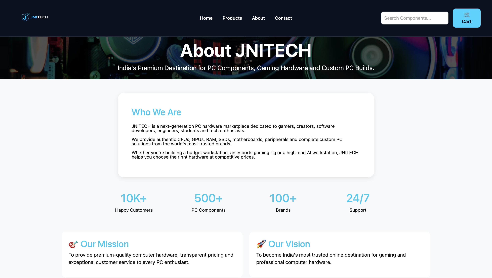
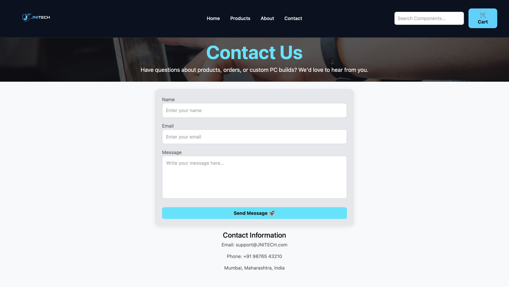

# JNITECH - PC Components E-Commerce Website

## Project Overview

JNITECH is a modern React-based PC Components E-Commerce website designed for gamers, creators, developers, and technology enthusiasts.

The website provides a professional interface for browsing premium computer hardware including CPUs, GPUs, RAM, and SSDs.

---

## Features

- Modern and responsive user interface
- Professional navigation bar
- Hero landing section
- Product showcase section
- Category-based browsing
- Dedicated CPU page
- Dedicated GPU page
- Dedicated RAM page
- Dedicated SSD page
- About Us page
- Contact Us page
- Customer Reviews section
- React Router navigation
- Component-based architecture

---

## Technologies Used

- React.js
- React Router DOM
- JavaScript (ES6+)
- HTML5
- CSS3
- Vite

---

## Screenshots

### Home Page


---

### Product Page



---

### Shop By Category



---

### CPU Collection



---

### GPU Collection



---

### RAM Collection



---

### SSD Collection



---

### About Page



---

### Contact Page



---

### Customer Reviews


---

## Installation

1. Clone the repository

```bash
git clone https://github.com/your-username/JNITECH.git
```

2. Navigate to the project folder

```bash
cd react-website
```

3. Install dependencies

```bash
npm install
```

4. Run the project

```bash
npm run dev
```

---

## Author

Developed as a React Frontend Project using React and Vite.
## Screenshots

### Home Page


### Product Page


### CPU Page


### GPU Page


### RAM Page


### SSD Page


### Shop By Category


### About Page


### Contact Page


### Customer Reviews

